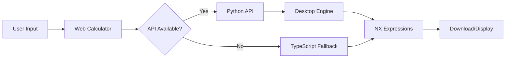

# AutoCrate V12 - Unified Calculation Engine

## Overview
AutoCrate V12 now uses a **unified calculation engine** that ensures the web application and desktop application generate identical NX expressions. This eliminates any drift between the two platforms by having the web app directly use the Python desktop calculation engine via an API.

## Architecture

### Components

1. **Desktop Python Engine** (`autocrate/nx_expressions_generator.py`)
   - The single source of truth for all calculations
   - Contains the `generate_crate_expressions_logic()` function
   - Handles all ASTM D6251-17 compliance calculations
   - Generates NX expressions exactly as required by Siemens NX

2. **Python API Server** (`api_server.py`)
   - Flask-based REST API server
   - Exposes the desktop calculation engine via HTTP
   - Runs on http://localhost:5000
   - Endpoints:
     - `GET /health` - Check server status
     - `POST /api/calculate` - Calculate crate dimensions
     - `POST /api/generate-nx` - Generate NX expressions
     - `POST /api/validate` - Validate specifications

3. **Web Application** (`web/`)
   - React/Next.js frontend
   - Automatically detects Python API availability
   - Falls back to TypeScript calculations if API is unavailable
   - Uses `PythonAPI` service (`web/src/services/python-api.ts`)

## How It Works

### Starting the System

1. **Start the Python API Server:**
   ```bash
   AutoCrate.bat
   # Select option 'A' for API Server
   ```
   Or directly:
   ```bash
   python api_server.py
   ```

2. **Start the Web Development Server:**
   ```bash
   AutoCrate.bat
   # Select option '1' for Web Dev Server
   ```
   Or directly:
   ```bash
   cd web
   npm run dev
   ```

3. **The web app will automatically:**
   - Check if Python API is available at http://localhost:5000
   - Use Python calculations if available (exact desktop engine)
   - Fall back to TypeScript if API is not running

### Calculation Flow



## Benefits

1. **Single Source of Truth**: One calculation engine for both platforms
2. **No Drift**: Eliminates possibility of calculation differences
3. **ASTM Compliance**: Ensures consistent compliance across platforms
4. **Maintenance**: Updates to calculations only need to be made once
5. **Testing**: Single test suite validates both platforms
6. **Fallback**: Web app remains functional even without API server

## API Endpoints

### Health Check
```bash
GET http://localhost:5000/health
```
Response:
```json
{
  "status": "healthy",
  "version": "12.0.2",
  "engine": "desktop_python"
}
```

### Calculate Dimensions
```bash
POST http://localhost:5000/api/calculate
Content-Type: application/json

{
  "productLength": 96,
  "productWidth": 48,
  "productHeight": 30,
  "productWeight": 1000,
  "panelThickness": 0.75,
  "clearance": 2.0
}
```

### Generate NX Expressions
```bash
POST http://localhost:5000/api/generate-nx
Content-Type: application/json

{
  "productLength": 96,
  "productWidth": 48,
  "productHeight": 30,
  "productWeight": 1000,
  "download": true
}
```

## Development Workflow

### For Desktop Development:
1. Edit `autocrate/nx_expressions_generator.py`
2. Test with desktop GUI (`python main.py`)
3. Changes automatically available to web via API

### For Web Development:
1. Start Python API server first
2. Edit web components in `web/src/`
3. Web app uses Python calculations automatically

### Testing:
1. Run desktop tests: `python test_nx_generation.py`
2. Run API tests: `curl http://localhost:5000/health`
3. Run web tests: `cd web && npm test`

## File Structure

```
AutoCrate V12/
├── api_server.py                 # Flask API server
├── autocrate/
│   └── nx_expressions_generator.py  # Desktop calculation engine
├── web/
│   └── src/
│       ├── services/
│       │   └── python-api.ts    # API client service
│       ├── components/
│       │   ├── Calculator.tsx   # Uses Python API
│       │   └── ResultsPanel.tsx # Downloads via API
│       └── lib/
│           └── autocrate-calculations-fixed.ts  # TypeScript fallback
└── AutoCrate.bat                # Master control with API option
```

## Troubleshooting

### API Server Won't Start
- Check if port 5000 is already in use
- Ensure Flask is installed: `pip install flask flask-cors`
- Check Python path and version

### Web App Not Detecting API
- Verify API server is running: `curl http://localhost:5000/health`
- Check browser console for CORS errors
- Ensure both servers are on same machine or update CORS settings

### Calculations Don't Match
- This should not happen with unified engine
- Check API server is using latest code
- Verify web app is successfully connecting to API
- Check fallback TypeScript is not being used unintentionally

## Future Enhancements

1. **Deployment**: Deploy API server to cloud for remote access
2. **Caching**: Add Redis caching for frequently used calculations
3. **WebSocket**: Real-time calculation updates
4. **Authentication**: Secure API endpoints for production
5. **Load Balancing**: Multiple API instances for high availability

---
*Last Updated: August 27, 2024*
*Version: 1.1.0*